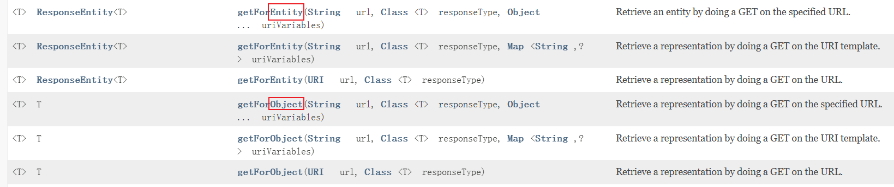

原视频：

<iframe src="//player.bilibili.com/player.html?isOutside=true&aid=1851137936&bvid=BV1gW421P7RD&cid=1450576283&p=1&autoplay=0" scrolling="no" border="0" frameborder="no" framespacing="0" allowfullscreen="true"></iframe>

# 运行环境要求

| 组件          | 版本         |
| ------------- | ------------ |
| java          | java17+      |
| cloud         | 2023.0.0     |
| boot          | 3.2.0        |
| cloud alibaba | 2022.0.0-RC2 |
| Maven         | 3.9+         |
| Mysql         | 8.0+         |

[前往尚硅谷课程笔记](./note.html)

| 模块                                                         | 用途                                                |
| :----------------------------------------------------------- | :-------------------------------------------------- |
| [cloud-provider-payment8001](##一. cloud-provider-payment8001) | 微服务提供者支付module模块8001                      |
| cloud-provider-payment8002                                   | 微服务提供者支付module模块8002                      |
| [cloud-consumer-order80](##二. cloud-consumer-order80)       | 微服务调用者订单module模块-使用LoadBalancer负载均衡 |
| [cloud-consumer-feign-order80](#Ⅳ. OpenFeign服务接口调用)    | 微服务调用者订单module模块-使用OpenFeign负载均衡    |
| [cloud-api-commons](##三. cloud-api-commons)                 | 对外暴露通用的组件/api/接口/工具类等                |


# Ⅰ. 微服务架构Base工程模块构建

## 一. cloud-provider-payment8001

微服务提供者支付module模块

### 微服务小口诀

建module->改pom->写yml->主启动->业务类

### Swagger3生成接口文档

| 注解           | 标注位置          | 作用                   |
| :------------- | :---------------- | :--------------------- |
| @**Tag**       | controller类      | 标识controller作用     |
| @Parameter     | 参数              | 标识参数的作用         |
| @Parameters    | 参数              | 标识参数的作用         |
| @**Schema**    | model层的JavaBean | 描述模型作用及每个属性 |
| @**Operation** | 方法              | 描述方法的作用         |
| @ApiResponse   | 方法              | 描述响应状态码等       |

含分组迭代的Config配置类

```java
import io.swagger.v3.oas.models.ExternalDocumentation;
import io.swagger.v3.oas.models.OpenAPI;
import io.swagger.v3.oas.models.info.Info;
import org.springdoc.core.models.GroupedOpenApi;
import org.springframework.context.annotation.Bean;
import org.springframework.context.annotation.Configuration;
@Configuration
public class Swagger3Config {
    @Bean
    public GroupedOpenApi PayApi()
    {
        return GroupedOpenApi.builder().group("支付微服务模块").pathsToMatch("/pay/**").build();
    }
    @Bean
    public GroupedOpenApi OtherApi()
    {
        return GroupedOpenApi.builder().group("其它微服务模块").pathsToMatch("/other/**", "/others").build();
    }
    @Bean
    public GroupedOpenApi CustomerApi()
    {
        return GroupedOpenApi.builder().group("客户微服务模块").pathsToMatch("/customer/**", "/customers").build();
    }

    @Bean
    public OpenAPI docsOpenApi()
    {
        return new OpenAPI()
                .info(new Info().title("cloud2024")
                        .description("通用设计rest")
                        .version("v1.0"))
                .externalDocs(new ExternalDocumentation()
                        .description("www.atguigu.com")
                        .url("https://yiyan.baidu.com/"));
    }
}
```

调用方式：[生成的swagger地址](http://localhost:8001/swagger-ui/index.html)
http://localhost:8001/swagger-ui/index.html

## 二. cloud-consumer-order80

微服务调用者订单module模块

### RestTemplate访问远程Http

RestTemplate提供了多种便捷**访问远程Http**服务的方法， 是一种简单便捷的访问restful服务模板类，是Spring提供的用于访问Rest服务的客户端模板工具集

[RestTemplate官网](https://docs.spring.io/spring-framework/docs/6.0.11/javadoc-api/org/springframework/web/client/RestTemplate.html)

使用restTemplate访问restful接口非常的简单粗暴无脑。

(url, requestMap, ResponseBean.class)这三个参数分别代表：REST请求地址、请求参数、HTTP响应转换被转换成的对象类型。



getForObject: 返回对象为响应体中数据转化成的对象，基本上可以理解为Json

getForEntity: 返回对象为ResponseEntity对象，包含了响应中的一些重要信息，比如响应头、响应状态码、响应体等

**get请求方法**

```java
<T> T getForObject(String url, Class<T> responseType, Object... uriVariables);

<T> T getForObject(String url, Class<T> responseType, Map<String, ?> uriVariables);

<T> T getForObject(URI url, Class<T> responseType);

<T> ResponseEntity<T> getForEntity(String url, Class<T> responseType, Object... uriVariables);

<T> ResponseEntity<T> getForEntity(String url, Class<T> responseType, Map<String, ?> uriVariables);

<T> ResponseEntity<T> getForEntity(URI var1, Class<T> responseType);
```

**post请求方法**

```java
<T> T postForObject(String url, @Nullable Object request, Class<T> responseType, Object... uriVariables);

<T> T postForObject(String url, @Nullable Object request, Class<T> responseType, Map<String, ?> uriVariables);

<T> T postForObject(URI url, @Nullable Object request, Class<T> responseType);

<T> ResponseEntity<T> postForEntity(String url, @Nullable Object request, Class<T> responseType, Object... uriVariables);

<T> ResponseEntity<T> postForEntity(String url, @Nullable Object request, Class<T> responseType, Map<String, ?> uriVariables);

<T> ResponseEntity<T> postForEntity(URI url, @Nullable Object request, Class<T> responseType);
```

### 硬编码写死问题

```java
public static final String PaymentSrv_URL = "http://localhost:8001";// 硬编码
```

[解决方式](##硬编码写死问题解决)

## 三. cloud-api-commons

对外暴露通用的组件/api/接口/工具类等

### 工程重构

发现系统中有重复部分，进行**工程重构**，将重复部分写入cloud-api-commons，将其作为对外暴露通用的组件/api/接口/工具类

对cloud-api-commons执行maven命令`clear`、`install`

```html
<!-- 对需要使用cloud-api-commons对外暴露的通用组件/api/接口/工具类的微服务引入自己定义的api通用包 -->
<dependency>
    <groupId>com.xi.cloud</groupId>
    <artifactId>cloud-api-commons</artifactId>
    <version>1.0-SNAPSHOT</version>
</dependency>
```

### 开始引入SpringCloud

微服务所在的IP地址和端口号硬编码到订单微服务中，会存在非常多的问题

1. 如果订单微服务和支付微服务的IP地址或者端口号发生了变化，则支付微服务将变得不可用，需要同步修改订单微服务中调用支付微服务的IP地址和端口号。
2. 如果系统中提供了多个订单微服务和支付微服务，则无法实现微服务的负载均衡功能。
3. 如果系统需要支持更高的并发，需要部署更多的订单微服务和支付微服务，硬编码订单微服务则后续的维护会变得异常复杂。

所以，在微服务开发的过程中，需要引入服务治理功能，实现微服务之间的动态注册与发现，从此刻开始我们**正式进入SpringCloud实战**

# Ⅱ. Consul服务注册与发现

微服务所在的IP地址和端口号硬编码到订单微服务中，会存在非常多的问题

1. 如果订单微服务和支付微服务的IP地址或者端口号发生了变化，则支付微服务将变得不可用，需要同步修改订单微服务中调用支付微服务的IP地址和端口号。
2. 如果系统中提供了多个订单微服务和支付微服务，则无法实现微服务的负载均衡功能。
3. 如果系统需要支持更高的并发，需要部署更多的订单微服务和支付微服务，硬编码订单微服务则后续的维护会变得异常复杂。

所以，在微服务开发的过程中，需要引入服务治理功能，实现微服务之间的动态注册与发现，从此刻开始我们正式进入SpringCloud实战

## consul 简介

[consul官网](https://developer.hashicorp.com/consul/docs)

Consul 是一套开源的**分布式服务发现和配置管理系统**，由 HashiCorp 公司用 Go 语言开发。

提供了微服务系统中的服务治理、配置中心、控制总线等功能。这些功能中的每一个都可以根据需要单独使用，也可以一起使用以构建全方位的服务网格，总之Consul提供了一种完整的服务网格解决方案。它具有很多优点。包括： 基于 raft 协议，比较简洁； 支持健康检查, 同时支持 HTTP 和 DNS 协议 支持跨数据中心的 WAN 集群 提供图形界面 跨平台，支持 Linux、Mac、Windows

[Spring Cloud consul官网](https://spring.io/projects/spring-cloud-consul)

Spring Cloud Consul 功能：

- 服务发现：提供HTTP和DNS两种发现方式
- 健康监测：支持多种方式，HTTP、TCP、Docker、Shell脚本定制
- KV存储：Key、Value的存储方式
- 多数据中心：Consul支持多数据中心

## consul使用

下载consul[Install | Consul | HashiCorp Developer](https://developer.hashicorp.com/consul/install#windows)

安装路径下`consul agent -dev`以开发模式启动

通过http://localhost:8500可以访问Consul的首页

**步骤**

1. pom引入坐标(下方有优化)

   ```html
   <!--SpringCloud consul discovery -->
   <dependency>
       <groupId>org.springframework.cloud</groupId>
       <artifactId>spring-cloud-starter-consul-discovery</artifactId>
   </dependency>
   ```

2. yml
   ```yaml
   spring:
     application:
       name: ???
     ####Spring Cloud Consul for Service Discovery(服务发现)
     cloud:
       consul:
         # 要入驻进的是哪个consul
         host: localhost
         port: 8500
         discovery:
           # 此模块将要以这个名字入驻进Consul
           service-name: ${spring.application.name}
   ```

3. 主启动
   `@EnableDiscoveryClient`: 放在启动类上， 开启服务发现

**启动时出现警告**

启动此服务控制台出现`Standard Commons Logging discovery in action with spring-jcl: please remove commons-logging.jar from classpath in order to avoid potential conflicts`提示，即“使用spring-jcl进行标准Commons日志发现:请从类路径中删除Commons - Logging .jar，以避免潜在的冲突”，可以正常运行，有代码洁癖可以使用以下方法解决

```html
<!--SpringCloud consul discovery -->
<dependency>
    <groupId>org.springframework.cloud</groupId>
    <artifactId>spring-cloud-starter-consul-discovery</artifactId>
    <!-- 排除Commons-Logging.jar，以避免潜在的冲突 -->
    <exclusions>
        <exclusion>
            <groupId>commons-logging</groupId>
            <artifactId>commons-logging</artifactId>
        </exclusion>
    </exclusions>
</dependency>
```

## 硬编码写死问题解决

**原问题**:

```java
public static final String PaymentSrv_URL = "http://localhost:8001";// 硬编码
```

**解决**：

```java
public static final String PaymentSrv_URL = "http://cloud-payment-service";// 入驻进spring cloud consul时8001微服务的名字
```

**但由此引发另一个问题**：`Caused by: java.net.UnknownHostException: cloud-payment-service`，如果通过微服务名称调用，consul默认有负载均衡，后面是多个(一个集群)，因此需要告诉[RestTemplate](###RestTemplate访问远程Http)(远程访问Http)要支持负载均衡

**解决**：
修改RestTemplate的配置类，在构造方法上加`@LoadBalanced`注解，提供RestTemplate(远程访问Http)对负载均衡的支撑

```java
@Configuration// 使用 @Configuration 标记类作为配置类替换 xml 配置文件
public class RestTemplateConfig {
    @Bean
    @LoadBalanced// 提供RestTemplate(远程访问Http)对负载均衡的支撑
    public RestTemplate restTemplate() {
        return new RestTemplate();
    }
}
```

## 三个注册中心异同点

| 组件名    | 语言 | CAP  | 服务健康检查 | 对外暴露接口 | SpriongCloud集成 |
| --------- | ---- | ---- | ------------ | ------------ | ---------------- |
| Eureka    | Java | AP   | 可配支持     | HTTP         | 已集成           |
| Consul    | Go   | CP   | 支持         | HTTP/DNS     | 已集成           |
| Zookeeper | Java | CP   | 支持         | 客户端       | 已集成           |

**CAP**

- C: Consistency（强一致性）
- A: Avaliblity（可用性）
- P: Partition tolerance（分区容错性）

**经典CAP图**

最多只能同时较好的满足两个。

 **CAP理论的核心**：一个分布式系统不可能同时很好的满足一致性，可用性和分区容错性这三个需求，

因此，根据 CAP 原理将 NoSQL 数据库分成了满足 CA 原则、满足 CP 原则和满足 AP 原则三 大类：

- CA - 单点集群，满足一致性，可用性的系统，通常在可扩展性上不太强大。
- CP - 满足一致性，分区容忍必的系统，通常性能不是特别高。
- AP - 满足可用性，分区容忍性的系统，通常可能对一致性要求低一些。


### AP架构


如Eureka，当网络分区出现后，为了保证可用性，系统B**可以返回旧值**，保证系统的可用性。

当数据出现不一致时，虽然A, B上的注册信息不完全相同，但每个Eureka节点依然能够正常对外提供服务，这会出现查询服务信息时如果请求A查不到，但请求B就能查到。如此保证了可用性但牺牲了一致性

**结论**：**违背了一致性**C的要求，只**满足可用性和分区容错**，即AP

### CP架构


如Zookeeper/Consul，当网络分区出现后，为了保证一致性，**就必须拒接请求**，否则无法保证一致性

Consul 遵循CAP原理中的CP原则，保证了强一致性和分区容错性，且使用的是Raft算法，比zookeeper使用的Paxos算法更加简单。虽然保证了强一致性，但是可用性就相应下降了，例如服务注册的时间会稍长一些，因为 Consul 的 raft 协议要求**必须过半数的节点都写入成功才认为注册成功 ；在leader挂掉了之后，重新选举出leader之前会导致Consul 服务不可用**。

**结论**：**违背了可用性**A的要求，只**满足一致性和分区容错**，即CP

## Consul服务的配置与刷新

微服务意味着要将单体应用中的业务拆分成一个个子服务，每个服务的粒度相对较小，因此系统中会出现**大量的服务**。由于**每个服务都需要必要的配置信息**才能运行，**所以一套集中式的、动态的配置管理设施是必不可少的**。

比如某些配置文件中的内容大部分都是相同的，只有个别的配置项不同。就拿数据库配置来说吧，如果每个微服务使用的技术栈都是相同的，则每个微服务中关于数据库的配置几乎都是相同的，有时候主机迁移了，**我希望一次修改，处处生效**。

当下我们每一个微服务自己带着一个application.yml，上百个配置文件的管理....../(ㄒoㄒ)/~~

### 服务配置**步骤**

**需求**

通过全局配置信息，直接注册进Consul服务器，从Consul获取，因此要遵守Consul的配置规则要求

 **步骤**

1. pom
   ```html
   <!--SpringCloud consul config consul配置管理-->
   <dependency>
       <groupId>org.springframework.cloud</groupId>
       <artifactId>spring-cloud-starter-consul-config</artifactId>
   </dependency>
   <dependency>
       <groupId>org.springframework.cloud</groupId>
       <artifactId>spring-cloud-starter-bootstrap</artifactId>
   </dependency>
   ```

2. yml
   [yml配置规则说明](####yml配置规则说明)

   新增bootstrop.yml

   ```yaml
   # 系统级配置
   spring:
     application:
       name: XXX
       ####Spring Cloud Consul for Service Discovery
     cloud:
       consul:
         host: localhost
         port: 8500
         discovery:
           service-name: ${spring.application.name}
         config:
           profile-separator: '-' # 官方默认分隔符为 ","，我们把它更新为 '-'
           format: YAML
   ```

   修改application.yml
   ```yaml
   # 用户级配置
   server:
     port: 8001
   
   # ==========applicationName + druid-mysql8 driver===================
   spring:
     datasource:
       type: com.alibaba.druid.pool.DruidDataSource
       driver-class-name: com.mysql.cj.jdbc.Driver
       url: jdbc:mysql://localhost:3306/db_name?characterEncoding=utf8&useSSL=false&serverTimezone=GMT%2B8&rewriteBatchedStatements=true&allowPublicKeyRetrieval=true
       username: root
       password: password
     profiles:
       active: dev # 多环境配置加载内容dev/prod,不写就是默认default配置
   
   # ========================mybatis===================
   mybatis:
     mapper-locations: classpath:mapper/*.xml
     type-aliases-package: com.xi.cloud.entities
     configuration:
       map-underscore-to-camel-case: true
   ```

3. [Consul服务器key/value配置填写](####Consul服务器key/value配置填写)
   创建文件

   - config/分布式微服务名字/data
   - ​             /分布式微服务名字-dev/data
   - ​             /分布式微服务名字-prod/data

   

4. 

   

#### yml配置规则说明


新增配置文件bootstrop.yml

- bootstrop.yml是什么？
  applicaiton.yml是**用户级**的资源配置项
  bootstrap.yml是**系统级**的，**优先级更加高**

  Spring Cloud会创建一个“Bootstrap Context”，作为Spring应用的`Application Context`的**父上下文**。初始化的时候，`Bootstrap Context`负责从外部源加载配置属性并解析配置。这两个上下文共享一个从外部获取的`Environment`。

  `Bootstrap`属性有高优先级，默认情况下，它们不会被本地配置覆盖。 `Bootstrap context`和`Application Context`有着不同的约定，所以新增了一个`bootstrap.yml`文件，保证`Bootstrap Context`和`Application Context`配置的分离。

   **application.yml文件改为bootstrap.yml,这是很关键的或者两者共存**

  因为bootstrap.yml是比application.yml先加载的。bootstrap.yml优先级高于application.yml

#### Consul服务器key/value配置填写

参考规则

```yaml
# config/分布式微服务名字/data # 不写就是默认default配置
#       /分布式微服务名字-dev/data
#       /分布式微服务名字-prod/data
```

1. 创建config文件夹，以/结尾

   

2. config文件下分别创建三个文件夹，以/结尾
   由于我们配置了`spring: cloud: consul: config: profile-separator: '-' # 官方默认分隔符为 ","，我们把它更新为 '-'`
   所以在config文件夹下创建`分布式微服务名字`、`分布式微服务名字-dev`、`分布式微服务名字-prod`三个文件夹，以/结尾
   

3. 第二步创建的三个文件夹下分别创建data文件(可写入内容)，data不再是文件夹
   

### 动态刷新步骤

主启动类上加上`@RefreshScope`注解，可以在服务器配置变更时自动刷新 默认间隔为55s后自动刷新

可修改配置文件`spring.cloud.consul.config.watch.tait-time: ?`?为秒数，修改间隔时间

## 引出问题

Consul重启后consul里的配置消失了

由此我们需要做Consul的配置持久化

[LoadBalancer解决Consul持久化](###LoadBalancer之Consul持久化)

# Ⅲ.LoadBalancer负载均衡服务调用

前身是Ribbon目前已进入维护模式

Spring Cloud Ribbon是基于Netflix Ribbon实现的一套**客户端    负载均衡**的工具。

简单的说，Ribbon是Netflix发布的开源项目，主要功能是**提供客户端的软件负载均衡算法和服务调用**。Ribbon客户端组件提供一系列完善的配置项如连接超时，重试等。简单的说，就是在配置文件中列出Load Balancer（简称LB）后面所有的机器，Ribbon会自动的帮助你基于某种规则（如简单轮询，随机连接等）去连接这些机器。我们很容易使用Ribbon实现自定义的负载均衡算法。

Ribbon未来替换方案：**spring-cloud-loadbalancer**

[spring-cloud-loadbalancer官网](https://docs.spring.io/spring-cloud-commons/docs/current/reference/html/#spring-cloud-loadbalancer)

## spring-cloud-loadbalancer是什么

**LB负载均衡(Load Balance)是什么**

简单的说就是将用户的请求平摊的分配到多个服务上，从而达到系统的HA（高可用），常见的负载均衡有软件Nginx，LVS，硬件 F5等

**spring-cloud-starter-loadbalancer组件是什么**

Spring Cloud LoadBalancer是由SpringCloud官方提供的一个开源的、简单易用的**客户端负载均衡器**，它包含在SpringCloud-commons中**用它来替换了以前的Ribbon组件**。相比较于Ribbon，SpringCloud LoadBalancer不仅能够支持RestTemplate，还支持WebClient（WeClient是Spring Web Flux中提供的功能，可以实现响应式异步请求）

## loadBalancer负载均衡

### 客户端和服务器端负载均衡的区别

loadbalancer本地负载均衡客户端和Nginx服务端负载均衡区别

- Nginx是**服务器负载均衡**，客户端所有请求都会交给nginx，然后由**nginx实现转发请求**，即负载均衡是由服务端实现的。
- loadbalancer**本地负载均衡**，在调用微服务接口时候，会在**注册中心上获取注册信息服务列表之后缓存到JVM本地**，从而在**本地实现RPC远程服务调用技术**。

### 负载均衡案例

#### 理论

80通过轮询负载访问8001、8002、8003


LoadBalancer 在工作时分成两步：

- **第一步**，先选择ConsulServer从服务端查询并拉取服务列表，知道了它有多个服务(上图3个服务)，这3个实现是完全一样的，默认轮询调用谁都可以正常执行。类似生活中求医挂号，某个科室今日出诊的全部医生，客户端你自己选一个。
- **第二步**，按照指定的负载均衡策略从server取到的服务注册列表中由客户端自己选择一个地址，所以LoadBalancer是一个**客户端的**负载均衡器。

#### 实操

1. 启动Consul，将8001、8002启动后注册进微服务

2. 订单80模块(客户端，消费者侧)**修改POM**并注册进consul**新增LoadBalancer组件**
   ```html
   <!--loadbalancer-->
   <dependency>
       <groupId>org.springframework.cloud</groupId>
       <artifactId>spring-cloud-starter-loadbalancer</artifactId>
   </dependency>
   ```

3. 修改Controller进行测试

   ```java
   @GetMapping(value = "/consumer/pay/get/info")
   private String getInfoByConsul() {
       // PaymentSrv_URL是注册进consul中的微服务名字(同一微服务名可能有多个不同端口的相同微服务)
       return restTemplate.getForObject(PaymentSrv_URL + "/pay/get/info", String.class);
   }
   ```

4. 发现交替访问8001、8002

### 负载均衡算法

默认**轮询**： $rest接口第几次请求数 \% 服务器集群总数量 = 实际调用服务器位置下标$ ，每次服务重启动后rest接口计数从1开始。

`List<ServiceInstance> instances = discoveryClient.getInstances("cloud-payment-service");`

如：` List [0] instances = 127.0.0.1:8002`

　　`　List [1] instances = 127.0.0.1:8001`

8001+ 8002 组合成为集群，它们共计2台机器，集群总数为2， 按照**轮询算法**原理：

- 当总请求数为1时： 1 % 2 =1 对应下标位置为1 ，则获得服务地址为127.0.0.1:8001
- 当总请求数位2时： 2 % 2 =0 对应下标位置为0 ，则获得服务地址为127.0.0.1:8002
- 当总请求数位3时： 3 % 2 =1 对应下标位置为1 ，则获得服务地址为127.0.0.1:8001
- 当总请求数位4时： 4 % 2 =0 对应下标位置为0 ，则获得服务地址为127.0.0.1:8002
- 如此类推......

默认有两种算法 轮询和随机，一般来说轮询就够用了

**修改负载均衡算法**

```java
@Configuration// 使用 @Configuration 标记类作为配置类替换 xml 配置文件
@LoadBalancerClient(value = "cloud-payment-service",configuration = RestTemplateConfig.class)// @LoadBalancerClient 将要对value这个微服务执行实现新的RestTemplate配置 这个配置在configuration这个类中      value值大小写一定要和consul里面的名字一样，必须一样       不使用这个注解默认为轮询
public class RestTemplateConfig {
    @Bean
    @LoadBalanced //使用@LoadBalanced注解赋予RestTemplate负载均衡的能力 提供RestTemplate(远程访问Http)对负载均衡的支撑
    public RestTemplate restTemplate(){
        return new RestTemplate();
    }

    /**
     * 默认轮询 加此方法，修改为了随机
     * @param environment
     * @param loadBalancerClientFactory
     * @return
     */
    @Bean    ReactorLoadBalancer<ServiceInstance> randomLoadBalancer(Environment environment,
                                                           LoadBalancerClientFactory loadBalancerClientFactory) {
        String name = environment.getProperty(LoadBalancerClientFactory.PROPERTY_NAME);

        return new RandomLoadBalancer(loadBalancerClientFactory.getLazyProvider(name, ServiceInstanceListSupplier.class), name);
    }
}
```

## LoadBalancer之Consul持久化

Consul数据持久化配置，并且注册为Windows服务

1. consul下载目录下新建空文件夹`mydata`和`consul_start.bat`文件

2. `consul_start.bat`内容信息

   ```bash
   @echo.服务启动......  
   @echo off  
   @sc create Consul binpath= "D:\devSoft\consul_1.17.0_windows_386\consul.exe agent -server -ui -bind=127.0.0.1 -client=0.0.0.0 -bootstrap-expect  1  -data-dir D:\devSoft\consul_1.17.0_windows_386\mydata   "
   @net start Consul
   @sc config Consul start= AUTO  
   @echo.Consul start is OK......success
   @pause
   ```

   - `@sc create Consul binpath= "Consul安装路径\consul.exe agent -server(以服务器后台形式启动) -ui -bind=127.0.0.1(绑定本机) -client=0.0.0.0 -bootstrap-expect  1  -data-dir consul的配置数据存储路径"`
   - `@sc config Consul start= AUTO (是否每次开机启动) `

3. 右键管理员权限打开

4. 后续consul的配置数据会保存进mydata文件夹

这样每次开机都会自动启动consul服务

# Ⅳ. OpenFeign服务接口调用

## Spring Cloud OpenFeign

**OpenFeign默认集成了LoadBalancer负载均衡功能**

Feign是一个**声明性web服务客户端**。它使编写web服务客户端变得更容易。**使用Feign创建一个接口并对其进行注释**。它具有可插入的注释支持，包括Feign注释和JAX-RS注释。Feign还支持可插拔编码器和解码器。Spring Cloud添加了对Spring MVC注释的支持，以及对使用Spring Web中默认使用的HttpMessageConverter的支持。Spring Cloud集成了Eureka、Spring Cloud CircuitBreaker以及Spring Cloud LoadBalancer，以便在使用Feign时提供负载平衡的http客户端。

**OpenFeign是一个声明式的Web服务客户端，只需创建一个Rest接口，并在该接口上添加注解`@FeignClient`即可**

OpenFeign基本上就是当前微服务之间调用的事实标准

**OpenFeign功能**

1. 可插拔的注解支持，包括Feign注解和JAX-RS注解
2. 支持可插拔的HTTP编码器和解码器
3. 支持Sentinel和它的Fallback
4. 支持SpringCloudLoadBalancer的负载均衡
5. 支持HTTP请求和响应的压缩

前面在使用**SpringCloud LoadBalancer**+RestTemplate时，利用RestTemplate对http请求的封装处理形成了一套模版化的调用方法。

**但是在实际开发中**，由于对服务依赖的调用可能不止一处，**往往一个接口会被多处调用，所以通常都会针对每个微服务自行封装一些客户端类来包装这些依赖服务的调用**。所以，OpenFeign在此基础上做了进一步封装，由他来帮助我们定义和实现依赖服务接口的定义。在OpenFeign的实现下，**我们只需创建一个接口并使用注解的方式来配置它(在一个微服务接口上面标注一个`@FeignClient`注解即可)**，即可完成对服务提供方的接口绑定，统一对外暴露可以被调用的接口方法，大大简化和降低了调用客户端的开发量，也即由服务提供者给出调用接口清单，消费者直接通过OpenFeign调用即可。

**OpenFeign同时还集成SpringCloud LoadBalancer**
可以在使用OpenFeign时提供Http客户端的负载均衡，也可以集成阿里巴巴Sentinel来提供熔断、降级等功能。而与SpringCloud LoadBalancer不同的是，**通过OpenFeign只需要定义服务绑定接口且以声明式的方法**，优雅而简单的实现了服务调用。

## OpenFeign通用步骤

OpenFeign默认集成了LoadBalancer负载均衡功能

微服务Api接口+`@FeignClient`注解标签


服务消费者80 → 调用含有@FeignClient注解的Api服务接口 → 服务提供者(8001/8002)

**流程步骤**

修改客户端

- pom

  ```html
  <!--openfeign-->
  <dependency>
      <groupId>org.springframework.cloud</groupId>
      <artifactId>spring-cloud-starter-openfeign</artifactId>
  </dependency>
  ```

- yml
  ```yaml
  server:
    port: XX
  spring:
    application:
      name: XXX
    ####Spring Cloud Consul for Service Discovery(服务发现)
    cloud:
      consul:
        host: localhost
        port: 8500
        discovery:
          # 80将要以这个名字入驻进Consul
          prefer-agent-address: true # 是否优先使用ip进行注册
          service-name: ${spring.application.name}
  ```

- 启动类

  ```java
  @SpringBootApplication
  @EnableDiscoveryClient // 该注解用于向使用consul为注册中心时注册服务
  @EnableFeignClients// 启用feign客户端,定义服务+绑定接口，以声明式的方法优雅而简单的实现服务调用
  ```

业务类
订单模块要去调用支付模块，订单和支付两个微服务，需要通过Api接口解耦，一般不要在订单模块写非订单相关的业务。
自己的业务自己做 + 其它模块走FeignApi接口调用

**修改对外暴露的通用模块**

- 引入pom
  ```html
  <!--openfeign-->
  <dependency>
      <groupId>org.springframework.cloud</groupId>
      <artifactId>spring-cloud-starter-openfeign</artifactId>
  </dependency>
  ```

- 新建服务接口`PayFeignApi`，头上配置`@FeignClient`注解
  ```java
  @FeignClient("注册进consul中的微服务名")
  public interface PayFeignApi
  ```

- 参考微服务8001的Controller层，新建PayFeignApi中的接口
  

- Controller
  ```java
  @RestController
  @Slf4j
  public class OrderController
  {
      @Resource
      private PayFeignApi payFeignApi;
  
      @PostMapping("/feign/pay/add")
      public ResultData addOrder(@RequestBody PayDTO payDTO) {
          System.out.println("第一步：模拟本地addOrder新增订单成功(省略sql操作)，第二步：再开启addPay支付微服务远程调用");
          ResultData resultData = payFeignApi.addPay(payDTO);
          return resultData;
      }
  }
  ```

## OpenFeign高级特性

配置类:

```java
@Configuration
public class FeignConfig {

    /**
     * OpenFeign配置重试机制bean
     * @return
     */
    @Bean
    public Retryer myRetryer() {
//        return Retryer.NEVER_RETRY; //Feign默认配置是不走重试策略的

        //修改最大请求次数为3(1初始次数+2重复次数)，初始间隔时间为100ms，重试间最大间隔时间为1s
        return new Retryer.Default(100,1,3);
    }

    /**
     * OpenFeign配置日志bean
     * @return
     */
    @Bean
    Logger.Level feignLoggerLevel() {
        return Logger.Level.FULL;
    }
}
```

yml:

```yaml
spring:
  cloud:
    openfeign:
      client:
        config:
#          default: # 全局通用配置
#            #连接超时时间
#            connectTimeout: 3000
#            #读取超时时间
#            readTimeout: 3000
          cloud-payment-service: # 全局通用配置
            #连接超时时间
            connectTimeout: 3000
            #读取超时时间
            readTimeout: 3000
      httpclient:
        hc5:
          enabled: true # 启用httpclient5提升性能. OpenFeign使用 Apache HttpClient 5 替换OpenFeign默认的HttpURLConnection 以提升性能
      compression: # 请求回应压缩
        request: # 请求
          enabled: true # 开启请求压缩功能
          min-request-size: 2048 # 最小触发压缩的大小
          mime-types: text/xml,application/xml,application/json # 触发压缩数据类型
        response: # 响应
          enabled: true # 开启响应压缩功能

# logging.level + 含有@FeignClient注解的完整带包名的接口名+debug级别
# feign日志以什么级别监控哪个接口(OpenFeign对外暴露服务功能清单的接口)
logging:
  level:
    com:
      xi:
        cloud:
          apis:
            # 日志级别:
            #- `NONE`：默认的，不显示任何日志；
            #- `BASIC`：仅记录请求方法、URL、响应状态码及执行时间；
            #- `HEADERS`：除了 `BASIC` 中定义的信息之外，还有请求和响应的头信息；
            #- `FULL`：除了 `HEADERS` 中定义的信息之外，还有请求和响应的正文及元数据。
            PayFeignApi: debug
```


### OpenFeign之超时控制

默认OpenFeign客户端等待60秒钟，但是服务端处理超过规定时间会导致Feign客户端返回报错。

为了避免这样的情况，有时候我们需要设置Feign客户端的超时控制，默认60秒太长或者业务时间太短都不好

**yml文件中开启配置**：

全局配置方式：

```yaml
spring:
 cloud:
  openfeign:
   client:
    config:
     default: # 全局通用配置
      connectTimeout: ??? # 连接超时时间
      readTimeout: ??? # 请求处理超时时间
```

指定配置方式：

```yaml
spring:
 cloud:
  openfeign:
   client:
    config:
     cloud-payment-service: # 调用此微服务的配置
      connectTimeout: ??? # 连接超时时间
      readTimeout: ??? # 请求处理超时时间
```

注：当全局和指定配置都有时，以更细致(指定)的为准

### OpenFeign之重试机制

默认重试机制是关闭的，给了默认值。

默认情况下会创建Retryer.NEVER_RETRY类型为Retryer的bean,这将禁用重试。
请注意，这种重试行为与Feign默认行为不同，它会自动重试 IOExceptions,.将它们视为与网络相关的瞬态异常，以及从ErrorDecoder抛出的任何RetryableException

**修改重试机制：**

```java
@Configuration
public class FeignConfig {
   /**
    * OpenFeign配置重试机制bean
    * 该方法写入OpenFeign的配置类中
    * @return
    */
    @Bean
    public Retryer myRetryer() {
        //return Retryer.NEVER_RETRY; //Feign默认配置是不走重试策略的

        //最大请求次数为3(1初始次数+2重复次数)，初始间隔时间为100ms，重试间最大间隔时间为1s
        return new Retryer.Default(100,1,3);
    }
}
```

以上配置目前控制台没有看到3次重试过程，只看到结果，**正常的，正确的**，是feign的日志打印问题

### OpenFeign之性能优化HttpClient5

PpenFeign中http client 如果不做特殊配置，**OpenFeign默认使用**JDK自带的**HttpURLConnection**发送HTTP请求，由于默认HttpURLConnection没有连接池、**性能和效率比较低**，如果采用默认，性能上不是最牛B的。

**所以使用Apache HttpClient 5** 替换OpenFeign默认的HttpURLConnection 以**提升性能**。

**步骤**

1. pom
   ```html
   <!-- Apache HttpClient 5 替换OpenFeign默认的HttpURLConnection 以提升性能 -->
   <!-- httpclient5-->
   <dependency>
       <groupId>org.apache.httpcomponents.client5</groupId>
       <artifactId>httpclient5</artifactId>
       <version>5.3</version>
   </dependency>
   <!-- feign-hc5-->
   <dependency>
       <groupId>io.github.openfeign</groupId>
       <artifactId>feign-hc5</artifactId>
       <version>13.1</version>
   </dependency>
   ```

2. yml
   ```yaml
   #  Apache HttpClient5 配置开启
   spring:
     cloud:
       openfeign:
         httpclient:
           hc5:
             enabled: true
   ```

### OpenFeign请求回应压缩

**对请求和响应进行GZIP压缩**

Spring Cloud OpenFeign支持对请求和响应进行GZIP压缩，以**减少通信过程中的性能损耗**。

通过下面的两个参数设置，就能**开启请求与相应的压缩功能**：

```yaml
spring:
 cloud:
  openfeign:
   compression: # 压缩
    request: # 请求
     enabled: true # 开启请求压缩
    response: # 响应
     enabled: true # 开启响应压缩
```

**细粒度化设置**

对请求压缩做一些更细致的设置，比如下面的配置内容指定压缩的请求数据类型并设置了请求压缩的大小下限，

只有超过这个大小的请求才会进行压缩：

```yaml
spring:
 cloud:
  openfeign:
   compression:
    request:
     enabled: true # 开启请求压缩
     mime-types: text/xml,application/xml,application/json #触发压缩数据类型
     min-request-size: 2048 #最小触发压缩的大小
```

### OpenFeign日志打印功能

Feign 提供了日志打印功能，我们可以通过配置来调整日志级别，从而了解 Feign 中 Http 请求的细节，说白了就是**对Feign接口的调用情况进行监控和输出**

**日志级别：**

- `NONE`：默认的，不显示任何日志；
- `BASIC`：仅记录请求方法、URL、响应状态码及执行时间；
- `HEADERS`：除了 `BASIC` 中定义的信息之外，还有请求和响应的头信息；
- `FULL`：除了 `HEADERS` 中定义的信息之外，还有请求和响应的正文及元数据。

**步骤**

1. 配置日志bean
   ```java
   /**
     * OpenFeign配置日志bean
     * 该方法写入OpenFeign的配置类中
     * @return
     */
   @Bean
   Logger.Level feignLoggerLevel() {
       return Logger.Level.FULL;// 返回需要的日志级别
   }
   ```

2. yml里配置需要开启日志的feign客户端
   ```yaml
   # logging.level + 含有@FeignClient注解的完整带包名的接口名+debug级别
   # feign日志以什么级别监控哪个接口(OpenFeign对外暴露服务功能清单的接口)
   logging:
     level:
       com:
         xi:
           cloud:
             apis:
               PayFeignApi: debug 
   ```

# Ⅴ.CircuitBreaker断路器

## 概述

### 问题

***上一任Hystrix：***

Hystrix是一个用于处理分布式系统的延迟和容错的开源库，在分布式系统里，许多依赖不可避免的会调用失败，比如超时、异常等，Hystrix能够保证在一个依赖出问题的情况下，不会导致整体服务失败，避免级联故障，以提高分布式系统的弹性。目前已进入维护状态。未来将使用Resilience4j替代。


***分布式系统面临的问题：***

复杂分布式体系结构中的应用程序有数十个依赖关系，每个依赖关系在某些时候将不可避免地失败。


***服务雪崩：***

多个微服务之间调用的时候，假设微服务A调用微服务B和微服务C，微服务B和微服务C又调用其它的微服务，这就是所谓的“扇出”。如果扇出的链路上某个微服务的调用响应时间过长或者不可用，对微服务A的调用就会占用越来越多的系统资源，进而引起系统崩溃，所谓的“雪崩效应”

对于高流量的应用来说，单一的后端依赖可能会导致所有服务器上的所有资源都在几秒钟内饱和。比失败更糟糕的是，这些应用程序还可能导致服务之间的延迟增加，备份队列，线程和其他系统资源紧张，导致整个系统发生更多的级联故障。这些都表示需要对故障和延迟进行隔离和管理，以便单个依赖关系的失败，不能取消整个应用程序或系统。

所以，通常当你发现**一个模块下的某个实例失败后，这时候这个模块依然还会接收流量，然后这个有问题的模块还调用了其他的模块，这样就会发生级联故障，或者叫雪崩。**

### 诉求

***问题：***

禁止服务雪崩故障

***解决：*** 

- 有问题的节点，快速熔断（快速返回失败处理或者返回默认兜底数据【服务降级】）。

“断路器”本身是一种开关装置，当某个服务单元发生故障之后，通过断路器的故障监控（类似熔断保险丝），**向调用方返回一个符合预期的、可处理的备选响应(FallBack)，而不是长时间的等待或者抛出调用方无法处理的异常**，这样就保证了服务调用方的线程不会被长时间、不必要地占用，从而避免了故障在分布式系统中的蔓延，乃至雪崩。

一句话，**出故障了“保险丝”跳闸，别把整个家给烧了，😄**

### 功能

- 服务熔断
  类比保险丝，保险丝闭合状态(CLOSE)可以正常使用，当达到最大服务访问后，直接拒绝访问跳闸限电(OPEN),此刻调用方会接受服务降级的处理并返回友好兜底提示，就是家里保险丝，从闭合CLOSE供电状态→跳闸OPEN打开状态
- 服务降级
  服务器忙，请稍后再试。不让客户端等待并立刻返回一个友好提示，fallback
- 服务限流
  秒杀高并发等操作，严禁一窝蜂的过来拥挤，大家排队，一秒钟N个，有序进行
- 服务限时
- 服务预热
- 接近实时的监控
- 兜底的处理动作
- ……

### CircuitBreaker

[Spring Cloud Circuit Breaker官网](https://spring.io/projects/spring-cloud-circuitbreaker)

CircuitBreaker的目的是保护分布式系统免受故障和异常，提高系统的可用性和健壮性。

当一个组件或服务出现故障时，CircuitBreaker会迅速切换到开放OPEN状态(保险丝跳闸断电)，阻止请求发送到该组件或服务从而避免更多的请求发送到该组件或服务。这可以减少对该组件或服务的负载，防止该组件或服务进一步崩溃，并使整个系统能够继续正常运行。同时，CircuitBreaker还可以提高系统的可用性和健壮性，因为它可以在分布式系统的各个组件之间自动切换，从而避免单点故障的问题。

**CircuitBreaker只是一套规范和接口，落地实现者是Resilience4j**

### Resilience4j

**是什么**

Resilience4j是一个专为函数式编程设计的**轻量级容错库**。Resilience4j提供高阶函数（装饰器），以通过断路器、速率限制器、重试或隔板增强任何功接口、lambda表达式或方法引用。您可以在任何函数式接口、lambda表达式或方法引用上堆叠多个装饰器。优点是您可以选择您需要的装饰器，而没有其他选择。 Resilience4j2需要Java17。

概述

Resilience4j提供了几个核心模块：

- **resilience4j-Circuitbreaker: 断路**
- **resilience4j-ratelimiter: 速率限制**
- **resilience4j-bulkhead: 舱壁**
- resilience4j-retry: 自动重试（同步和异步）
- resilience4j-timelimiter: 超时处理
- resilience4j-cache: 结果缓存
- 还有用于指标、Feign、Kotlin、Spring、Ratpack、Vertx、RxJava2等的附加模块。

## 熔断(CircuitBreaker)(服务熔断+服务降级)

断路器(CircuitBreaker)

### 断路器三大状态

断路器有三个普通状态：**关闭**(CLOSED)、**开启**(OPEN)、**半开**(HALF_OPEN)，还有两个特殊状态：**禁用**(DISABLED、**强制开启**(FORCED_OPEN)

当熔断器关闭时，所有的请求都会通过熔断器。。

- 如果**失败率超过设定的阈值**，熔断器就会从关闭状态**转换到打开状态**，这时**所有的请求都会被拒绝**。
- 当经过**一段时间后**，熔断器会从打开状态转换到半开状态，这时**仅有一定数量的请求会被放入**，并**重新计算失败率**。
- 如果**失败率超过阈值**，则变为**打开**状态；
  如果**失败率低于阈值**，则变为**关闭**状态。

断路器使用滑动窗口来存储和统计调用的结果。你可以选择**基于调用数量的滑动窗口**或者**基于时间的滑动窗口**。

- 基于访问数量的滑动窗口统计了**最近N次**调用的返回结果。
- 居于时间的滑动窗口统计了**最近N秒**的调用回结果。

除此以外，熔断器还会有两种特殊状态：DISABLED(始终允许访问)和FORCED_OPEN(始终拒绝访问)。

- 这两个状态不会生成熔断器事件（除状态装换外），并且不会记录事件的成功或者失败。
- 退出这两个状态的唯一方法是触发状态转换或者重置熔断器。

### 断路器所有配置参数参考

[Resilience4j-Guides-Chinese/中文文档](https://github.com/lmhmhl/Resilience4j-Guides-Chinese/blob/main/core-modules/CircuitBreaker.md)

| 配置                                         | 默认值                                      |含义|
| -------------------------------------------- | ------------------------------------------------------------ | ------------------------------------------------------------ |
| failure-rate-threshold                       | 50                     | 以百分比配置失败率峰值                                       |
| sliding-window-type                          | COUNT_BASED            | 断路器的滑动窗口期类型 可以基于“次数”（COUNT_BASED）或者“时间”（TIME_BASED）进行熔断，默认是COUNT_BASED。 |
| sliding-window-size                          | 100                       | 若COUNT_BASED，则10次调用中有50%失败（即5次）打开熔断断路器；若为TIME_BASED则，此时还有额外的两个设置属性，含义为：在N秒内（sliding-window-size）100%（slow-call-rate-threshold）的请求超过N秒（slow-call-duration-threshold）打开断路器。 |
| slowCallRateThreshold                        | 100            | 以百分比的方式配置，断路器把调用时间大于slowCallDurationThreshold的调用视为慢调用，当慢调用比例大于等于峰值时，断路器开启，并进入服务降级。 |
| slowCallDurationThreshold                    | 60000[ms]           | 配置调用时间的峰值，高于该峰值的视为慢调用。                 |
| permitted-number-of-calls-in-half-open-state | 10 | 运行断路器在HALF_OPEN状态下时进行N次调用，如果故障或慢速调用仍然高于阈值，断路器再次进入打开状态。 |
| minimum-number-of-calls                      | 100                   | 在每个滑动窗口期样本数，配置断路器计算错误率或者慢调用率的最小调用数。比如设置为5意味着，在计算故障率之前，必须至少调用5次。如果只记录了4次，即使4次都失败了，断路器也不会进入到打开状态。 |
| wait-duration-in-open-state                  | 60000[ms]         | 从OPEN到HALF_OPEN状态需要等待的时间                          |

### 断路器流程


**断路器开启或关闭的条件**

1. 当满足一定的峰值和失败率达到一定条件后，断路器将会进入OPEN状态（保险丝跳闸），服务熔断
2. 当OPEN的时候，所有请求都不会调用主业务逻辑方法，而是直接走fallbackmetnod!兜底背锅方法，服务降级
3. 一段时间之后，这个时候断路器会从OPEN进入到HALF_OPEN半开状态，会放几个请求过去探探链路是否通？如成功，断路器会关闭CLOSE(类似保险丝闭合，恢复可用)；如失败，继续开启。重复上述

**基于计数器的滑动窗口**

- 6次访问中当执行方法的失败率达到50%时CircuitBreaker将进入开启OPEN**状态**(保险丝跳闸断电)拒绝所有请求。
- 等待**5**秒后，CircuitBreaker 将自动从开启OPEN状态过渡到半开HALF_OPEN状态，允许一些请求通过以测试服务是否恢复正常。
- 如还是异常CircuitBreaker 将重新进入开启OPEN状态；如正常将进入关闭CLOSE闭合状态恢复正常处理请求。

**基于时间的滑动窗口**

基于时间的滑动窗口是通过有N个桶的环形数组实现。

- 如果滑动窗门的大小为10秒，这个环形数组总是有10个桶，每个桶统计了在这一秒发生的所有调用的结果（部分统计结果)，数组中的第一个桶存储了当前这一秒内的所有调用的结果，其他的桶存储了之前每秒调用的结果。
- 滑动窗口不会单独存储所有的调用结果，而是对每个桶内的统计结果和总的统计值进行增量的更新，当新的调用结果被记录时，总的统计值会进行增量更新。
- 检索快照（总的统计值）的时间复杂度为0()，因为快照已经预先统计好了，并且和滑动窗口大小无关
- 关于此方法实现的空间需求（内存消耗）约等于0)。由于每次调用结果（元组）不会被单独存储，只是对N个桶进行单独统计和一次总分的统计。
- 每个桶在进行部分统计时存在三个整型，为了计算，失败调用数，慢调用数，总调用数。还有一个long类型变量，存储所有调用的响应时间。、

建议不要混合用，推荐按照调用次数count_based。

### 步骤

pom

```html
<!--resilience4j-circuitbreaker服务熔断降级-->
<dependency>
    <groupId>org.springframework.cloud</groupId>
    <artifactId>spring-cloud-starter-circuitbreaker-resilience4j</artifactId>
</dependency>
<!-- 由于断路保护等需要AOP实现，所以必须导入AOP包 -->
<dependency>
    <groupId>org.springframework.boot</groupId>
    <artifactId>spring-boot-starter-aop</artifactId>
</dependency>
```

yml
①基于计数器的滑动窗口案例

```yaml
spring:
 cloud:
  openfeign:
   # 开启circuitbreaker和分组激活 spring.cloud.openfeign.circuitbreaker.enabled
   circuitbreaker: # 断路器
    enabled: true # 开启断路器
    group:
     enabled: true #没开分组永远不用分组的配置。精确优先、分组次之(开了分组)、默认最后
     
 # Resilience4j CircuitBreaker 按照次数：COUNT_BASED 的例子
#  6次访问中当执行方法的失败率达到50%时CircuitBreaker将进入开启OPEN状态(保险丝跳闸断电)拒绝所有请求。
#  等待5秒后，CircuitBreaker 将自动从开启OPEN状态过渡到半开HALF_OPEN状态，允许一些请求通过以测试服务是否恢复正常。
#  如还是异常CircuitBreaker 将重新进入开启OPEN状态；如正常将进入关闭CLOSE闭合状态恢复正常处理请求。
resilience4j:
  circuitbreaker:
    configs:
      default: # default配置
        failureRateThreshold: 50 #设置50%的调用失败时打开断路器，超过失败请求百分⽐CircuitBreaker变为OPEN(跳闸)状态。
        slidingWindowType: COUNT_BASED # 滑动窗口的类型 按计数器统计
        slidingWindowSize: 6 #滑动窗⼝的⼤⼩配置COUNT_BASED表示6个请求，配置TIME_BASED时表示6秒
        minimumNumberOfCalls: 6 #断路器计算失败率或慢调用率之前所需的最小样本(每个滑动窗口周期)。如果minimumNumberOfCalls为10，则必须最少记录10个样本，然后才能计算失败率。如果只记录了9次调用，即使所有9次调用都失败，断路器也不会开启。
        automaticTransitionFromOpenToHalfOpenEnabled: true # 是否启用自动从开启状态过渡到半开状态，默认值为true。如果启用，CircuitBreaker将自动从开启状态过渡到半开状态，并允许一些请求通过以测试服务是否恢复正常
        waitDurationInOpenState: 5s #从OPEN到HALF_OPEN状态需要等待的时间
        permittedNumberOfCallsInHalfOpenState: 2 #半开状态允许的最大请求数，默认值为10。在半开状态下，CircuitBreaker将允许最多permittedNumberOfCallsInHalfOpenState个请求通过，如果其中有任何一个请求失败，CircuitBreaker将重新进入开启状态。
        recordExceptions: # 只要报这个异常 就进入服务熔断
          - java.lang.Exception
    instances: # 实例
      cloud-payment-service: # 微服务名
        baseConfig: default # 指定default配置
```

②基于时间的滑动窗口案例

```yaml
spring:
 cloud:
  openfeign:
   # 开启circuitbreaker和分组激活 spring.cloud.openfeign.circuitbreaker.enabled
   circuitbreaker: # 断路器
    enabled: true # 开启断路器
    group:
     enabled: true #没开分组永远不用分组的配置。精确优先、分组次之(开了分组)、默认最后

# Resilience4j CircuitBreaker 按照时间：TIME_BASED 的例子
resilience4j:
  timelimiter: # 时间限制器
    configs:
      default:
        timeout-duration: 10s #神坑的位置，timelimiter 默认限制远程1s，超于1s就超时异常，配置了降级，就走降级逻辑
  circuitbreaker: # 断路器
    configs:
      default: # default配置
        failureRateThreshold: 50 #设置50%的调用失败时打开断路器，超过失败请求百分⽐CircuitBreaker变为OPEN状态。
        slowCallDurationThreshold: 2s #慢调用时间阈值，高于这个阈值的视为慢调用并增加慢调用比例。
        slowCallRateThreshold: 30 #慢调用百分比峰值，断路器把调用时间⼤于slowCallDurationThreshold，视为慢调用，当慢调用比例高于阈值，断路器打开，并开启服务降级
        slidingWindowType: TIME_BASED # 滑动窗口的类型
        slidingWindowSize: 2 #滑动窗口的大小配置，配置TIME_BASED表示2秒
        minimumNumberOfCalls: 2 #断路器计算失败率或慢调用率之前所需的最小样本(每个滑动窗口周期)。
        permittedNumberOfCallsInHalfOpenState: 2 #半开状态允许的最大请求数，默认值为10。
        waitDurationInOpenState: 5s #从OPEN到HALF_OPEN状态需要等待的时间
        recordExceptions: # 只要报这个异常 就进入服务熔断
          - java.lang.Exception
    instances:  # 实例
      cloud-payment-service: # 微服务名
        baseConfig: default # 指定default配置
```

controller演示

```java
@RestController
public class OrderCircuitController {
    @Resource
    private PayFeignApi payFeignApi;

    @GetMapping(value = "/feign/pay/circuit/{id}")
    @CircuitBreaker(name = "cloud-payment-service", fallbackMethod = "myCircuitFallback")// 保险丝注解，name=要调用的微服务名字 fallbackMethod=出问题时兜底的服务降级的方法
    public String myCircuitBreaker(@PathVariable("id") Integer id) {
        // 正常调用 调用远程feign 异常时走fallbackMethod中的方法
        return payFeignApi.myCircuit(id);
    }

    //myCircuitFallback就是服务降级后的兜底处理方法
    public String myCircuitFallback(Integer id,Throwable t) {
        // 这里是容错处理逻辑，返回备用结果
        return "myCircuitFallback (服务降级)，系统繁忙，请稍后再试-----/(ㄒoㄒ)/~~";
    }
}
```

## 隔离(BulkHead)

### 概述

**是什么：**

- bulkhead(船的)舱壁/(飞机的)隔板
  隔板来自造船行业，床仓内部一般会分成很多小隔舱，一旦一个隔舱漏水因为隔板的存在而不至于影响其它隔舱和整体船。

[Resilience4j-Guides-bulkhead中文文档](https://github.com/lmhmhl/Resilience4j-Guides-Chinese/blob/main/core-modules/bulkhead.md)

**作用：**用于限并发

- 依赖隔离&负载保护：用来限制对于下游服务的最大并发数量的限制
- 基本上就是我们JUC信号灯内容的同样思想

Resilience4**提供了如下两种隔离的实现方式**，可以限制并发执行的数量

- 信号量舱壁（实现SemaphoreBulkhead）
- 固定线程舱壁（实现FixedThreadPoolBulkhead）

### 信号量舱壁（SemaphoreBulkhead）

#### 原理

- 当信号量有空闲时，进入系统的请求会直接获取信号量并开始业务处理。
- 当信号量全被占用时，接下来的请求将会进入阻塞状态，SemaphoreBulkhead提供了一个阻塞计时器。
- 如果阻塞状态的请求在阻塞计时内无法获取到信号量则系统会拒绝这些请求。
- 若请求在阻塞计时内获取到了信号量，那将直接获取信号量并执行相应的业务处理。

#### 步骤

1. pom
   ```html
   <!--resilience4j-bulkhead-->
   <dependency>
       <groupId>io.github.resilience4j</groupId>
       <artifactId>resilience4j-bulkhead</artifactId>
   </dependency>
   ```

2. yml
   ```yaml
   spring:
    cloud:
     #开启circuitbreaker和分组激活
     circuitbreaker:
      enabled: true
      group:
       enabled: true #没开分组永远不用分组的配置。精确优先、分组次之(开了分组)、默认最后
       
   ####resilience4j bulkhead 舱壁隔离的例子
   resilience4j:
    bulkhead: # 舱壁
     configs:
       default:
        maxConcurrentCalls: 2 # 隔离允许并发线程执行的最大数量 默认25
        maxWaitDuration: 1s # 当达到并发调用数量时，新的线程的阻塞时间，我只愿意等待1秒，过时不候进舱壁兜底fallback 默认0s
     instances: # 实例
      cloud-payment-service: # 微服务名
       baseConfig: default # 指定default配置
    timelimiter: # 时间限制器
     configs:
      default:
       timeout-duration: 20s # 神坑的位置，timelimiter 默认限制远程1s，超于1s就超时异常，配置了降级，就走降级逻辑
   ```

3. 业务类
   `@Bulkhead(name = "远程调用的微服务名字",fallbackMethod = "舱壁隔离后的兜底处理方法",type = Bulkhead.Type.EMAPHORE(隔离类型)`

   ```java
   /**
    *(船的)舱壁,隔离
    * @param id
    * @return
    */
   @GetMapping(value = "/feign/pay/bulkhead/{id}")
   @Bulkhead(name = "cloud-payment-service",fallbackMethod = "myBulkheadFallback",type = Bulkhead.Type.SEMAPHORE)
   public String myBulkhead(@PathVariable("id") Integer id)
   {
       return payFeignApi.myBulkhead(id);
   }
   public String myBulkheadFallback(Throwable t)
   {
       return "myBulkheadFallback，隔板超出最大数量限制，系统繁忙，请稍后再试-----/(ㄒoㄒ)/~~";
   }
   ```

本地测试步骤

- 浏览器新打开2个窗口，各点一次，分别点击http://localhost/feign/pay/bulkhead/9999
- 每个请求调用需要耗时5秒，2个线程瞬间达到配置过的最大并发数2
- 此时第3个请求正常的请求访问，http://localhost/feign/pay/bulkhead/3
- 直接被舱壁限制隔离了，碰不到8001

### 固定线程池舱壁（FixedThreadPoolBulkhead）

#### 原理

FixedThreadPoolBulkhead的功能与SemaphoreBulkhead一样也是**用于限制并发执行的次数**的，但是二者的实现原理存在差别而且表现效果也存在细微的差别。FixedThreadPoolBulkhead**使用一个固定线程池和一个等待队列来实现舱壁。**

- 当线程池中存在空闲时，则此时进入系统的请求将直接进入线程池开启新线程或使用空闲线程来处理请求。
- 当线程池中无空闲时时，接下来的请求将进入等待队列，
  -   若等待队列仍然无剩余空间时接下来的请求将直接被拒绝
  -   在队列中的请求等待线程池出现空闲时，将进入线程池进行业务处理。

另外：ThreadPoolBulkhead只对CompletableFuture方法有效，所以我们必创建返回CompletableFuture类型的方法

#### 步骤

1. pom
   ```html
   <!--resilience4j-bulkhead-->
   <dependency>
       <groupId>io.github.resilience4j</groupId>
       <artifactId>resilience4j-bulkhead</artifactId>
   </dependency>
   ```

2. yml
   ```yaml
   ####resilience4j bulkhead -THREADPOOL的例子
   resilience4j:
     timelimiter:
       configs:
         default:
           timeout-duration: 10s #timelimiter默认限制远程1s，超过报错不好演示效果所以加上10秒
     # 由于ThreadPoolBulkhead只对CompletableFuture方法有效，而CompletableFuture使用线程池是新启一个
     # spring.cloud.openfeign.circuitbreaker.group.enabled 请设置为false 新启线程和原来主线程脱离
     thread-pool-bulkhead:
       configs:
         default:
           core-thread-pool-size: 1 # 核心的
           max-thread-pool-size: 1 # 最大的 max-thread-pool-size 包含core-thread-pool-size 所以两个线程就满了
           queue-capacity: 1 # 队列 # max-thread-pool-size + ueue-capacity = 2， 1个在max + 1个在队列，第三个来报错
       instances:
         cloud-payment-service:
           baseConfig: default
   ```

3. 业务类
   ```java
   /**
     *(船的)舱壁,隔离 type = Bulkhead.Type.THREADPOOL 固定线程池舱壁
     * ThreadPoolBulkhead只对CompletableFuture方法有效,而CompletableFuture必须新开一个线程
     * @param id
     * @return CompletableFuture 必须返回CompletableFuture
     */
   @GetMapping(value = "/feign/pay/bulkhead/{id}")
   @Bulkhead(name = "cloud-payment-service",fallbackMethod = "myBulkheadPoolFallback",type = Bulkhead.Type.THREADPOOL)// THREADPOOL：线程池
   public CompletableFuture<String> myBulkhead(@PathVariable("id") Integer id) {
       System.out.println(Thread.currentThread().getName()+"\t"+"-----开始进入");
       try {
           TimeUnit.SECONDS.sleep(3);
       } catch (InterruptedException e) {
           throw new RuntimeException(e);
       }
       System.out.println(Thread.currentThread().getName()+"\t"+"-----准备离开");
       return CompletableFuture.supplyAsync(() -> payFeignApi.myBulkhead(id) + "\t" + "Bulkhead.Type.THREADPOOL固定线程池壁");
   }
   //myBulkheadPoolFallback就是舱壁隔离后的兜底处理方法
   public CompletableFuture<String> myBulkheadPoolFallback(Integer id, Throwable t) {
       return CompletableFuture.supplyAsync(() -> "Bulkhead.Type.THREADPOOL固定线程池壁，系统繁忙，请稍后再试-----/(ㄒoㄒ)/~~");
   }
   ```

## 限流(RateLimiter)

### 概述

[Resilience4j-Guides-ratelimiter中文官网](https://github.com/lmhmhl/Resilience4j-Guides-Chinese/blob/main/core-modules/ratelimiter.md)

限流 就是限制最大访问流量。系统能提供的最大并发是有限的，同时来的请求又太多，就需要限流。 

比如商城秒杀业务，瞬时大量请求涌入，服务器忙不过就只好排队限流了，和去景点排队买票和去医院办理业务排队等号道理相同。

所谓限流，就是通过对并发访问/请求进行限速，或者对一个时间窗口内的请求进行限速，以保护应用系统，一旦达到限制速率则可以拒绝服务、排队或等待、降级等处理。

### 常见限流算法

#### 漏桶算法

**概念：**
一个固定容量的漏桶，按照设定常量固定速率流出水滴，类似医院打吊针，不管你源头流量多大，我设定匀速流出。 如果流入水滴超出了桶的容量，则流入的水滴将会溢出了(被丢弃)，而漏桶容量是不变的。


**缺点**：
这里有两个变量，一个是桶的大小，支持流量突发增多时可以存多少的水（burst），另一个是水桶漏洞的大小（rate）。因为漏桶的漏出速率是固定的参数，所以，即使网络中不存在资源冲突（没有发生拥塞），漏桶算法也不能使流突发（burst）到端口速率。因此，漏桶算法**对于存在突发特性的流量来说缺乏效率**。


#### 令牌桶算法

类似哈尔滨冰雪大世界     载具类比令牌


SpringCloud默认使用该算法

#### 滚动时间窗(tumbling time window)

允许固定数量的请求进入(比如1秒取4个数据相加[每个值代表一个人的请求次数]，超过25值就over)超过数量就拒绝或者排队，等下一个时间段进入。

由于是在一个时间间隔内进行限制，如果用户在上个时间间隔结束前请求（**但没有超过限制**），同时在当前时间间隔刚开始请求（**同样没超过限制**），在各自的时间间隔内，这些请求都是正常的。下图统计了3次，but......

 

**缺点：**
间隔临界的一段时间内的请求就会超过系统限制，可能导致系统被压垮

**由于计数器算法存在时间临界点缺陷，因此在时间临界点左右的极短时间段内容易遭到攻击。**


假如设定1分钟最多可以请求100次某个接口，如12:00:00-12:00:59时间段内没有数据请求但12:00:59-12:01:00时间段内突然并发100次请求，紧接着瞬间跨入下一个计数周期计数器清零；在12:01:00-12:01:01内又有100次请求。那么也就是说在时间临界点左右可能同时有2倍的峰值进行请求，从而造成后台处理请求**加倍过载**的bug，导致系统运营能力不足，甚至导致系统崩溃，/(ㄒoㄒ)/~~

#### 滑动时间窗口（sliding time window）

顾名思义，该时间窗口是滑动的。所以，从概念上讲，这里有两个方面的概念需要理解： 

- 窗口：需要定义窗口的大小(比如时间或者次数)
- 滑动：需要定义在窗口中滑动的大小，但理论上讲滑动的大小不能超过窗口大小

滑动窗口算法是把固定时间片进行划分并且随着时间移动，移动方式为开始时间点变为时间列表中的第2个时间点，结束时间点增加一个时间点

不断重复，通过这种方式可以巧妙的避开计数器的临界点的问题。下图统计了5次


### 步骤

pom

```html
<!--resilience4j-ratelimiter 限流-->
<dependency>
    <groupId>io.github.resilience4j</groupId>
    <artifactId>resilience4j-ratelimiter</artifactId>
</dependency>
```

yml

```yaml
####resilience4j ratelimiter 限流的例子
resilience4j:
  ratelimiter:
    configs:
      default:
        limitForPeriod: 2 #在一次刷新周期内，允许执行的最大请求数
        limitRefreshPeriod: 1s # 限流器每隔limitRefreshPeriod刷新一次，将允许处理的最大请求数量重置为limitForPeriod
        timeout-duration: 1 # 线程等待权限的默认等待时间
    instances:
        cloud-payment-service:
          baseConfig: default
```

业务类

```java
@GetMapping(value = "/feign/pay/ratelimit/{id}")
@RateLimiter(name = "cloud-payment-service",fallbackMethod = "myRatelimitFallback")
public String myRatelimit(@PathVariable("id") Integer id) {
    return payFeignApi.myRatelimit(id);
}
public String myRatelimitFallback(Integer id,Throwable t) {
    return "你被限流了，禁止访问/(ㄒoㄒ)/~~";
}
```

测试

刷新`http://localhost/feign/pay/ratelimit/11`地址，正常后F5按钮狂刷一会儿，停止刷新看到被限流的效果

# Ⅵ. Sleuth(Micrometer)+ZipKin分布式链路追踪

## 概述

Sleuth停止维护，Spring Cloud Sleuth不适用于Spring Boot3.x及以上版本。Sleuth支持的最后一个Spring Boot主要版本是2.x;
新一代替换者是Micrometer Tracing，新一代Spring Cloud Sleuth: Micrometer

在微服务框架中，一个由客户端发起的请求在后端系统中会经过多个不同的的服务节点调用来协同产生最后的请求结果，每一个前段请求都会形成一条复杂的分布式服务调用链路，链路中的任何一环出现高延时或错误都会引起整个请求最后的失败。

在分布式与微服务场景下，我们需要解决如下**问题**：

- 在大规模分布式与微服务集群下，如何实时观测系统的整体调用链路情况。
- 在大规模分布式与微服务集群下，如何快速发现并定位到问题。
- 在大规模分布式与微服务集群下，如何尽可能精确的判断故障对系统的影响范围与影响程度。
- 在大规模分布式与微服务集群下，如何尽可能精确的梳理出服务之间的依赖关系，并判断出服务之间的依赖关系是否合理。
- 在大规模分布式与微服务集群下，如何尽可能精确的分析整个系统调用链路的性能与瓶颈点。
- 在大规模分布式与微服务集群下，如何尽可能精确的分析系统的存储瓶颈与容量规划。

上述问题就是我们的落地议题答案：

分布式链路追踪技术要解决的问题，分布式链路追踪（Distributed Tracing），就是将一次分布式请求还原成调用链路，进行日志记录，性能监控并将一次分布式请求的调用情况集中展示。比如各个服务节点上的耗时、请求具体到达哪台机器上、每个服务节点的请求状态等等。

## 新一代Spring Cloud Sleuth：Micrometer

Spring Cloud Sleuth(micrometer)提供了一套完整的分布式链路追踪(Distributed Tracing)解决方案且兼容支持了zipkin展现

将一次分布式请求还原成调用链路，进行日志记录和性能监控，并将一次分布式请求的调用情况集中web展示

**行内比较成熟的其他分布式链路追踪技术解决方案：**

| 技术           | 说明                                                         |
| -------------- | ------------------------------------------------------------ |
| Cat            | 由大众点评开源，基于开发的实时应用监控平台，包括实时应用监控，业务监控。集成方案是通过代码埋 点的方式来实现监控，比如：拦载器，过滤器等。对代码的侵入性很大，集成成本较高。风险较大。 |
| ZipKin         | 由Twitter公司开源，开放源代码分布式的跟踪系统，用于收集服务的定时数据，以解决微服务架构中的延迟问题，包括：数据的收集、存储、查找和展现。结合spring-cloud-sleuth使用较为简单，集成方便，但是功能较简单。 |
| Pinpoint       | Pinpoint是一款开源的基于字节码注入的调用链分析，以及应用监控分析工具。特点是支持多种插件，UI功能强大，接入端无代码侵入。 |
| **Skywalking** | SkyWalking是国人开源的基于字节码注入的调用链分析，以及应用监控分析工具。特点是支持多种插件，U功能较强，接入端无代码侵入。 |

##  原理

假定三个微服务调用的链路如下图所示：Service 1 调用 Service 2，Service 2 调用 Service 3 和 Service 4。


那么**一条链路追踪会在每个服务调用的时候加上Trace ID (全局id)和 Span ID(每次请求发出的ID)**

- Trace ID: 链路通过TraceId唯一标识
- Span ID: Span标识发起的请求信息，各span通过parent id 关联起来 (Span:表示调用链路来源，通俗的理解span就是一次请求信息)


**上图的精简版：**

一条链路通过Trace Id唯一标识，Span标识发起的请求信息，各span通过parent id 关联起来


1. 第一个节点：Span ID = A，Parent ID = null，Service 1 接收到请求。
2. 第二个节点：Span ID = B，Parent ID= A，Service 1 发送请求到 Service 2 返回响应给Service 1 的过程。
3. 第三个节点：Span ID = C，Parent ID= B，Service 2 的 中间解决过程。
4. 第四个节点：Span ID = D，Parent ID= C，Service 2 发送请求到 Service 3 返回响应给Service 2 的过程。
5. 第五个节点：Span ID = E，Parent ID= D，Service 3 的中间解决过程。
6. 第六个节点：Span ID = F，Parent ID= C，Service 3 发送请求到 Service 4 返回响应给 Service 3 的过程。
7. 第七个节点：Span ID = G，Parent ID= F，Service 4 的中间解决过程。
8. 通过 Parent ID 就可找到父节点，整个链路即可以进行跟踪追溯了。

## ZipKin图形化的工具

### 介绍

Zipkin是一种**分布式链路跟踪系统图形化的工具**，Zipkin 是 Twitter 开源的分布式跟踪系统，能够收集微服务运行过程中的实时调用链路信息，并能够将**这些调用链路信息展示到Web图形化界面上**供开发人员分析，开发人员能够从ZipKin中分析出调用链路中的性能瓶颈，识别出存在问题的应用程序，进而定位问题和解决问题。

### 产生

当没有配置 Sleuth 链路追踪的时候，INFO 信息里面是 [passjava-question,,,]，后面跟着三个空字符串。

当配置了 Sleuth 链路追踪的时候，追踪到的信息是 [passjava-question,504a5360ca906016,e55ff064b3941956,false] ，第一个是 Trace ID，第二个是 Span ID。**只有日志没有图，观看不方便，不美观，so，**引入图形化Zipkin链路监控让你好看，O(∩_∩)O

### 起步

[Quickstart · OpenZipkin下载](https://zipkin.io/pages/quickstart.html)

运行jar包`java -jar xxx.jar`

http://localhost:9411/zipkin/

## Micrometer+ZipKin搭建链路监控

### 分工

- Micrometer：数据采样
- ZipKin：图形展示

### 步骤

#### 总体父工程

pom

```html
<properties>
    <micrometer-tracing.version>1.2.0</micrometer-tracing.version>
    <micrometer-observation.version>1.12.0</micrometer-observation.version>
    <feign-micrometer.version>12.5</feign-micrometer.version>
    <zipkin-reporter-brave.version>2.17.0</zipkin-reporter-brave.version>
</properties>

<!--micrometer-tracing-bom导入链路追踪版本中心  1-->
<dependency>
    <groupId>io.micrometer</groupId>
    <artifactId>micrometer-tracing-bom</artifactId>
    <version>${micrometer-tracing.version}</version>
    <type>pom</type>
    <scope>import</scope>
</dependency>
<!--micrometer-tracing指标追踪  2-->
<dependency>
    <groupId>io.micrometer</groupId>
    <artifactId>micrometer-tracing</artifactId>
    <version>${micrometer-tracing.version}</version>
</dependency>
<!--micrometer-tracing-bridge-brave适配zipkin的桥接包 3-->
<dependency>
    <groupId>io.micrometer</groupId>
    <artifactId>micrometer-tracing-bridge-brave</artifactId>
    <version>${micrometer-tracing.version}</version>
</dependency>
<!--micrometer-observation 4-->
<dependency>
    <groupId>io.micrometer</groupId>
    <artifactId>micrometer-observation</artifactId>
    <version>${micrometer-observation.version}</version>
</dependency>
<!--feign-micrometer 5-->
<dependency>
    <groupId>io.github.openfeign</groupId>
    <artifactId>feign-micrometer</artifactId>
    <version>${feign-micrometer.version}</version>
</dependency>
<!--zipkin-reporter-brave 6-->
<dependency>
    <groupId>io.zipkin.reporter2</groupId>
    <artifactId>zipkin-reporter-brave</artifactId>
    <version>${zipkin-reporter-brave.version}</version>
</dependency>
```

由于Micrometer Tracing是一个门面工具自身并没有实现完整的链路追踪系统，具体的链路追踪另外需要引入的是第三方链路追踪系统的依赖

| 序号 | 引入模块                        | 用途                                                         |
| ---- | ------------------------------- | ------------------------------------------------------------ |
| 1    | micrometer-tracing-bom          | 导入链路追踪版本中心，体系化说明                             |
| 2    | micrometer-tracing              | 指标追踪                                                     |
| 3    | micrometer-tracing-bridge-brave | 一个Micrometer模块，用于与分布式跟踪工具 Brave 集成，以收集应用程序的分布式跟踪数据。Brave是一个开源的分布式跟踪工具，它可以帮助用户在分布式系统中跟踪请求的流转，它使用一种称为"跟踪上下文"的机制，将请求的跟踪信息存储在请求的头部，然后将请求传递给下一个服务。在整个请求链中，Brave会将每个服务处理请求的时间和其他信息存储到跟踪数据中，以便用户可以了解整个请求的路径和性能。 |
| 4    | micrometer-observation          | 一个基于度量库 Micrometer的观测模块，用于收集应用程序的度量数据。 |
| 5    | feign-micrometer                | 一个Feign HTTP客户端的Micrometer模块，用于收集客户端请求的度量数据。 |
| 6    | zipkin-reporter-brave           | 一个用于将 Brave 跟踪数据报告到Zipkin 跟踪系统的库。         |

#### 微服务提供者8001

pom

```html
<!--micrometer链路追踪监控-->
<!--micrometer-tracing指标追踪  1-->
<dependency>
    <groupId>io.micrometer</groupId>
    <artifactId>micrometer-tracing</artifactId>
</dependency>
<!--micrometer-tracing-bridge-brave适配zipkin的桥接包 2-->
<dependency>
    <groupId>io.micrometer</groupId>
    <artifactId>micrometer-tracing-bridge-brave</artifactId>
</dependency>
<!--micrometer-observation 3-->
<dependency>
    <groupId>io.micrometer</groupId>
    <artifactId>micrometer-observation</artifactId>
</dependency>
<!--feign-micrometer 4-->
<dependency>
    <groupId>io.github.openfeign</groupId>
    <artifactId>feign-micrometer</artifactId>
</dependency>
<!--zipkin-reporter-brave 5-->
<dependency>
    <groupId>io.zipkin.reporter2</groupId>
    <artifactId>zipkin-reporter-brave</artifactId>
</dependency>
```

yml

```yaml
# ========================zipkin分布式链路跟踪系统图形化工具===================
management:
  zipkin:
    tracing:
      endpoint: http://localhost:9411/api/v2/spans
  tracing:
    sampling:
      probability: 1.0 #采样率百分比 采样率默认为0.1(0.1就是10次只能有一次被记录下来)，值越大收集越及时。
```

业务类

```java
@RestController
public class PayMicrometerController {
    /**
     * Micrometer(Sleuth)进行链路监控的例子
     * @param id
     * @return
     */
    @GetMapping(value = "/pay/micrometer/{id}")
    public String myMicrometer(@PathVariable("id") Integer id) {
        return "Hello, 欢迎到来myMicrometer inputId:  "+id+" \t    服务返回:" + IdUtil.simpleUUID();
    }
}
```

#### 用于对外暴露的feignApi接口

```java
/**
  * Micrometer(Sleuth)进行链路监控的例子
  * @param id
  * @return
  */
@GetMapping(value = "/pay/micrometer/{id}")
public String myMicrometer(@PathVariable("id") Integer id);
```

#### 服务调用者80

```html
<!--micrometer-tracing指标追踪  1-->
<dependency>
    <groupId>io.micrometer</groupId>
    <artifactId>micrometer-tracing</artifactId>
</dependency>
<!--micrometer-tracing-bridge-brave适配zipkin的桥接包 2-->
<dependency>
    <groupId>io.micrometer</groupId>
    <artifactId>micrometer-tracing-bridge-brave</artifactId>
</dependency>
<!--micrometer-observation 3-->
<dependency>
    <groupId>io.micrometer</groupId>
    <artifactId>micrometer-observation</artifactId>
</dependency>
<!--feign-micrometer 4-->
<dependency>
    <groupId>io.github.openfeign</groupId>
    <artifactId>feign-micrometer</artifactId>
</dependency>
<!--zipkin-reporter-brave 5-->
<dependency>
    <groupId>io.zipkin.reporter2</groupId>
    <artifactId>zipkin-reporter-brave</artifactId>
</dependency>
```

yml

```yaml
# zipkin图形展现地址和采样率设置
management:
  zipkin:
    tracing:
      endpoint: http://localhost:9411/api/v2/spans
  tracing:
    sampling:
      probability: 1.0 #采样率默认为0.1(0.1就是10次只能有一次被记录下来)，值越大收集越及时。
```


### 测试

本次案例默认已经成功启动ZipKin

依次启动8001/80两个微服务并注册进入Consul

测试地址 http://localhost/feign/micrometer/1

查看zipkin http://localhost:9411/
