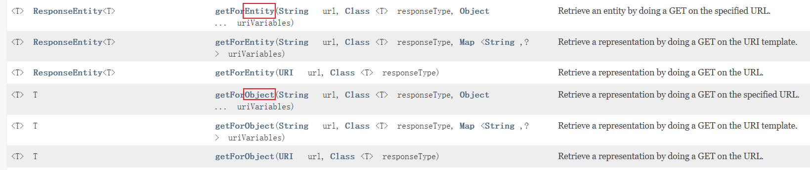

原视频：

<iframe src="//player.bilibili.com/player.html?isOutside=true&aid=1851137936&bvid=BV1gW421P7RD&cid=1450576283&p=1&autoplay=0" scrolling="no" border="0" frameborder="no" framespacing="0" allowfullscreen="true"></iframe>

### 运行环境要求

| 组件           | 版本           | 
|---------------|--------------|
| java          | java17+      |
| cloud         | 2023.0.0     |
| boot          | 3.2.0        |
| cloud alibaba | 2022.0.0-RC2 |
| Maven         | 3.9+         |
| Mysql         | 8.0+         |

[前往尚硅谷课程笔记](./note.html)

| 模块                                                         | 用途                                 |
| :----------------------------------------------------------- | :----------------------------------- |
| [cloud-provider-payment8001](##一. cloud-provider-payment8001) | 微服务提供者支付module模块           |
| [cloud-consumer-order80](##二. cloud-consumer-order80)       | 微服务调用者订单module模块           |
| [cloud-api-commons](##三. cloud-api-commons)                 | 对外暴露通用的组件/api/接口/工具类等 |


## 一. cloud-provider-payment8001

微服务提供者支付module模块

### 微服务小口诀

建module->改pom->写yml->主启动->业务类

### Swagger3生成接口文档

| 注解           | 标注位置          | 作用                   |
| :------------- | :---------------- | :--------------------- |
| @**Tag**       | controller类      | 标识controller作用     |
| @Parameter     | 参数              | 标识参数的作用         |
| @Parameters    | 参数              | 标识参数的作用         |
| @**Schema**    | model层的JavaBean | 描述模型作用及每个属性 |
| @**Operation** | 方法              | 描述方法的作用         |
| @ApiResponse   | 方法              | 描述响应状态码等       |

含分组迭代的Config配置类
```java
import io.swagger.v3.oas.models.ExternalDocumentation;
import io.swagger.v3.oas.models.OpenAPI;
import io.swagger.v3.oas.models.info.Info;
import org.springdoc.core.models.GroupedOpenApi;
import org.springframework.context.annotation.Bean;
import org.springframework.context.annotation.Configuration;
@Configuration
public class Swagger3Config {
    @Bean
    public GroupedOpenApi PayApi()
    {
        return GroupedOpenApi.builder().group("支付微服务模块").pathsToMatch("/pay/**").build();
    }
    @Bean
    public GroupedOpenApi OtherApi()
    {
        return GroupedOpenApi.builder().group("其它微服务模块").pathsToMatch("/other/**", "/others").build();
    }
    @Bean
    public GroupedOpenApi CustomerApi()
    {
        return GroupedOpenApi.builder().group("客户微服务模块").pathsToMatch("/customer/**", "/customers").build();
    }

    @Bean
    public OpenAPI docsOpenApi()
    {
        return new OpenAPI()
                .info(new Info().title("cloud2024")
                        .description("通用设计rest")
                        .version("v1.0"))
                .externalDocs(new ExternalDocumentation()
                        .description("www.atguigu.com")
                        .url("https://yiyan.baidu.com/"));
    }
}
```

调用方式：[生成的swagger地址](http://localhost:8001/swagger-ui/index.html)
http://localhost:8001/swagger-ui/index.html

## 二. cloud-consumer-order80

微服务调用者订单module模块

### RestTemplate访问远程Http

RestTemplate提供了多种便捷**访问远程Http**服务的方法， 是一种简单便捷的访问restful服务模板类，是Spring提供的用于访问Rest服务的客户端模板工具集

[RestTemplate官网](https://docs.spring.io/spring-framework/docs/6.0.11/javadoc-api/org/springframework/web/client/RestTemplate.html)

使用restTemplate访问restful接口非常的简单粗暴无脑。

(url, requestMap, ResponseBean.class)这三个参数分别代表：REST请求地址、请求参数、HTTP响应转换被转换成的对象类型。



getForObject: 返回对象为响应体中数据转化成的对象，基本上可以理解为Json

getForEntity: 返回对象为ResponseEntity对象，包含了响应中的一些重要信息，比如响应头、响应状态码、响应体等

**get请求方法**

```java
<T> T getForObject(String url, Class<T> responseType, Object... uriVariables);

<T> T getForObject(String url, Class<T> responseType, Map<String, ?> uriVariables);

<T> T getForObject(URI url, Class<T> responseType);

<T> ResponseEntity<T> getForEntity(String url, Class<T> responseType, Object... uriVariables);

<T> ResponseEntity<T> getForEntity(String url, Class<T> responseType, Map<String, ?> uriVariables);

<T> ResponseEntity<T> getForEntity(URI var1, Class<T> responseType);
```

**post请求方法**

```java
<T> T postForObject(String url, @Nullable Object request, Class<T> responseType, Object... uriVariables);

<T> T postForObject(String url, @Nullable Object request, Class<T> responseType, Map<String, ?> uriVariables);

<T> T postForObject(URI url, @Nullable Object request, Class<T> responseType);

<T> ResponseEntity<T> postForEntity(String url, @Nullable Object request, Class<T> responseType, Object... uriVariables);

<T> ResponseEntity<T> postForEntity(String url, @Nullable Object request, Class<T> responseType, Map<String, ?> uriVariables);

<T> ResponseEntity<T> postForEntity(URI url, @Nullable Object request, Class<T> responseType);
```

## 三. cloud-api-commons

对外暴露通用的组件/api/接口/工具类等

### 工程重构

发现系统中有重复部分，进行**工程重构**，将重复部分写入cloud-api-commons，将其作为对外暴露通用的组件/api/接口/工具类

对cloud-api-commons执行maven命令`clear`、`install`

```html
<!-- 对需要使用cloud-api-commons对外暴露的通用组件/api/接口/工具类的微服务引入自己定义的api通用包 -->
<dependency>
    <groupId>com.xi.cloud</groupId>
    <artifactId>cloud-api-commons</artifactId>
    <version>1.0-SNAPSHOT</version>
</dependency>
```

### 开始引入SpringCloud

**硬编码写死问题**

```java
public static final String PaymentSrv_URL = "http://localhost:8001";// 硬编码
```

微服务所在的IP地址和端口号硬编码到订单微服务中，会存在非常多的问题

1. 如果订单微服务和支付微服务的IP地址或者端口号发生了变化，则支付微服务将变得不可用，需要同步修改订单微服务中调用支付微服务的IP地址和端口号。
2. 如果系统中提供了多个订单微服务和支付微服务，则无法实现微服务的负载均衡功能。
3. 如果系统需要支持更高的并发，需要部署更多的订单微服务和支付微服务，硬编码订单微服务则后续的维护会变得异常复杂。

所以，在微服务开发的过程中，需要引入服务治理功能，实现微服务之间的动态注册与发现，从此刻开始我们**正式进入SpringCloud实战**

